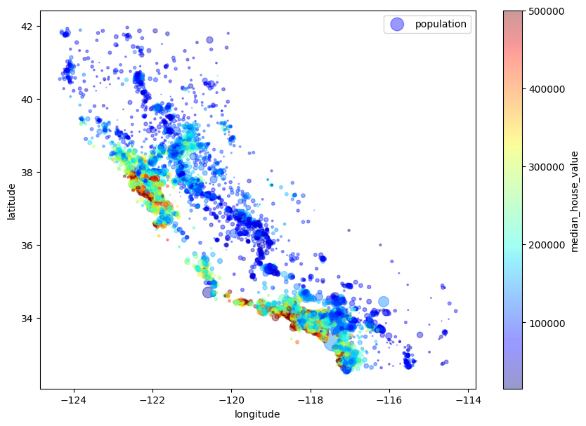

# ML-Project

This project is an analysis of the housing prices dataset from StatLib repository. This data is based on data from 1990 California census. The data includes metrics such as the population, median income, and median housing price for each block group in California where the block group is the smallest geographical unit for which the US census bureau publishes sample data. These block group usually consists with a population around 600 to 3000 people. In short thee block groups are called "Districts"

1. Look at the big picture.
2. Get the data.
3. Discover and visualize the data to gain insights.
4. Prepare the data for machine learning algorithms.
5. Select a model and train it.
6. Fine tune the model
7. Present the silutions
8. Launch, Monitor and maintain the system.

And the analysis will display the main steps of a Machine learning project as follows. And this is a self learning project of mine to study the important steps of a machine learning project. For the analysis Scikit-Learn and TensoeFlow libraries and Keras deep learning API are used.

